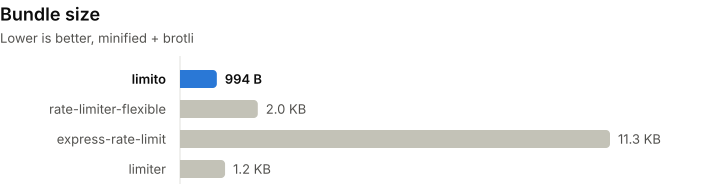

<p align="center">
    
</p>

<p align="center">
  <a href="https://www.npmjs.com/package/limito"></a>
  <a href="https://github.com/SleepyDaniel/limito"></a>
  <a href="https://www.npmjs.com/package/limito"></a>
</p>

<h1 align="center">limito</h1>

Rate limiter for JavaScript. It's about 1 KB, has zero dependencies and works on Node, Bun, Deno, Cloudflare Workers and in the browser.

<picture>
  <source media="(prefers-color-scheme: dark)" srcset="./bench/results/ops-node.dark.svg">
  
</picture>

## Why limito

- **Fast:** on Node it's up to 3x faster than limiter and express-rate-limit, and 6-25x faster than rate-limiter-flexible. See the [benchmarks](./bench/results/README.md).
- **Light on memory:** 38 to 63 bytes per key, 3 to 11 times less than the others.
- **No timers:** nothing runs in the background, and checking a known key doesn't allocate.
- **Redis:** `limito/redis` shares limits between servers and works with any client.

## Install

```sh
bun add limito
```

```sh
npm i limito
```

## Usage

```ts
import { limito } from 'limito'

const rl = limito({ limit: 100, window: '1m' })

const wait = rl('user:42')
if (wait) console.log(`try again in ${wait}ms`)
```

`rl(key)` returns `0` if the request is allowed, otherwise how many ms until it would be.

### Pacing your own calls

```ts
const github = limito({ limit: 5000, window: '1h' })

for (const repo of repos) {
  await github.wait('api')
  await fetch(`https://api.github.com/repos/${repo}`)
}
```

`wait()` resolves once the request fits, so you can also pace your calls to someone else's API. It's not meant for incoming requests. The request counts as soon as you call it, even if the client is gone by then.

### Hono

```ts
import { Hono } from 'hono'
import { getConnInfo } from 'hono/bun'
import { ipKey, limito } from 'limito'
import { rateLimit } from 'limito/hono'

const app = new Hono()
const rl = limito({ limit: 100, window: '1m' })

app.use(rateLimit(rl, (c) => ipKey(getConnInfo(c).remote.address)))
```

The second argument picks the key. Not on Bun? Import `getConnInfo` from `hono/deno`, `hono/cloudflare-workers` or `@hono/node-server/conninfo` instead.

Behind a proxy that address is the proxy's. Use a header your proxy sets, like `cf-connecting-ip` on Cloudflare or `x-real-ip` from nginx:

```ts
app.use(rateLimit(rl, (c) => ipKey(c.req.header('cf-connecting-ip'))))
```

This only works if clients can't reach the app directly. Don't key on `x-forwarded-for` as is, the first entry is whatever the client sent.

### Express

```ts
import express from 'express'
import { limito } from 'limito'
import { rateLimit } from 'limito/express'

const app = express()
const rl = limito({ limit: 100, window: '1m' })

app.use(rateLimit(rl))
```

Limits by `ipKey(req.ip)`. Behind a proxy, set `trust proxy` to the number of proxies in front of your app, like `app.set('trust proxy', 1)`. Setting it to `true` lets clients pick their own IP with `X-Forwarded-For`. To limit by something else, pass a key function, like `rateLimit(rl, (req) => req.user.id)` after your auth middleware. Don't key on anything the client can change freely, like an unchecked `x-api-key` header.

Blocked requests get a 429 with the `RateLimit`, `RateLimit-Policy` and `Retry-After` headers. If the key function returns `undefined`, the request fails with an error instead of sharing one bucket with everyone else. Same for anything that isn't a string or number, like an array from a JSON body. Both take the [Redis limiter](#redis) too. For your own response, call `rl()` and [`headers()`](#headersinfo-wait) yourself.

### Redis

If you run more than one server, use `limito/redis` so they all share the same limits. You'll want it on Cloudflare Workers and serverless too, since each instance has its own memory.

```ts
import { Redis } from 'ioredis'
import { limito } from 'limito/redis'

const redis = new Redis()
const rl = limito({
  limit: 100,
  window: '1m',
  send: ([cmd, ...args]) => redis.call(cmd, ...args),
})

const wait = await rl('user:42')
```

`send` gets a command as an array of strings and runs it, so any Redis client works:

| client | `send` |
| --- | --- |
| ioredis | `([cmd, ...args]) => redis.call(cmd, ...args)` |
| node-redis | `(args) => client.sendCommand(args)` |
| Bun | `([cmd, ...args]) => redis.send(cmd, args)` |

Same API as the in-memory limiter, just async and without `clear()` and `size`. The clock comes from Redis, so drift between your servers doesn't matter, and keys expire on their own once refilled.

### Burst and cost

```ts
const api = limito({ limit: 10, window: '1s', burst: 1 })
api('user:42')

const uploads = limito({ limit: 10, window: '1s' })
uploads('user:42', 5)
```

`burst` is how many requests can go through back to back. `burst: 1` spaces them out evenly, one every 100ms for `api`. `cost` makes one call count as several, and if it's bigger than `burst` you get `Infinity`.

## API

### `limito(options)`

| option | type | default | |
| --- | --- | --- | --- |
| `limit` | `number` | | requests per window |
| `window` | `number \| string` | | ms, or a string like `'500ms'`, `'10s'`, `'15m'`, `'1h'`, `'1d'` |
| `burst` | `number` | `limit` | requests allowed back to back, at least 1 |
| `max` | `number` | `1_000_000` | most keys kept at once |

Keys can be strings or numbers. Anything else throws. When the store hits `max`, it drops expired keys, then the ones closest to being refilled, until it's 75% full. Blocked keys go last. Set `max` well above the number of keys you expect.

| method | returns | |
| --- | --- | --- |
| `rl(key, cost = 1)` | `number` | `0` if allowed, else ms to wait. `Infinity` if `cost` is bigger than `burst`, throws if it's negative or `NaN` |
| `rl.peek(key, cost = 1)` | `number` | same as `rl()` but doesn't count the request |
| `rl.wait(key, cost = 1)` | `Promise<void>` | resolves once the request fits and counts it. Rejects if `cost` is bigger than `burst`, negative or `NaN` |
| `rl.info(key)` | `{ limit, remaining, reset, window }` | `reset` is ms until the key is fully refilled |
| `rl.reset(key)` | `void` | forget one key |
| `rl.clear()` | `void` | forget all keys |
| `rl.size` | `number` | keys currently tracked |

### `limito(options)` from `limito/redis`

Takes `limit`, `window` and `burst` like above, plus:

| option | type | default | |
| --- | --- | --- | --- |
| `send` | `(args: [string, ...string[]]) => Promise<unknown>` | | runs a raw Redis command |
| `prefix` | `string` | `'limito:'` | keys are stored as `<prefix><window>/<limit>/<burst>:<key>` |

`rl()`, `rl.peek()`, `rl.wait()`, `rl.info()` and `rl.reset()` work the same but return promises. Limiters with different settings get different Redis keys, so a login limiter and an API limiter can both key on the user id. `7` and `'7'` are the same key here, but not in memory.

### `rateLimit(rl, key)` from `limito/hono` and `limito/express`

Takes any limito limiter and a function that returns the key for a request, or a promise of it. In Express `key` is optional and defaults to `ipKey(req.ip)`. In Hono, pass your env type to get a typed `c`: `rateLimit<AppEnv>(rl, (c) => c.get('user').id)`.

### `ipKey(ip)`

Returns IPv4 addresses as they are and IPv6 addresses as their /64 network, like `2001:db8:0:0::/64`, since one IPv6 user usually has a whole /64 to rotate through. Some ISPs hand out a /56 or /48, so for logins add a second, looser limiter on a shorter prefix. `::ffff:1.2.3.4` becomes `1.2.3.4`, and anything malformed comes back unchanged.

### `headers(info, wait?)`

Turns `rl.info()` into headers from [draft-ietf-httpapi-ratelimit-headers](https://datatracker.ietf.org/doc/draft-ietf-httpapi-ratelimit-headers/). `Retry-After` is added when `wait` is a positive, finite number, so you can pass `rl()`'s result straight in.

With `limit: 100, window: '1m'` and the limit used up:

```ts
const wait = rl('user:42')
headers(rl.info('user:42'), wait)
// { 'ratelimit-policy': '"default";q=100;w=60', ratelimit: '"default";r=0;t=60', 'retry-after': '1' }
```

## How it works

Instead of counting requests, GCRA (generic cell rate algorithm) stores one timestamp per key: the time when that key will have its full allowance back. Every request moves it forward by `window / limit`. If that pushes it more than `burst` steps past now, the request is rejected and the difference is how long to wait.

Keys go in a `Map` that points to a slot in a `Float64Array`. The slot numbers are small ints, which V8 doesn't box, and the timestamps live in the typed array, so updating a key doesn't allocate. Freed slots get reused. When the array fills up, or once per burst window, limito drops expired keys and grows or shrinks the array. At `max` it also drops the keys closest to being refilled. It finds the cutoff by sorting a sample of about 4,000 keys instead of all of them.

`limito/redis` runs the same math as a Lua script. The whole check happens inside Redis in one call, so two servers can't read the same value and both let a request through.

## Benchmarks

Run on an Apple M5 with Node 24.18 and Bun 1.4.2. All libraries use their in-memory store with the same limit and window. The full tables and setup notes are in [bench/results](./bench/results/README.md).

<picture>
  <source media="(prefers-color-scheme: dark)" srcset="./bench/results/memory.dark.svg">
  
</picture>

<picture>
  <source media="(prefers-color-scheme: dark)" srcset="./bench/results/size.dark.svg">
  
</picture>

<picture>
  <source media="(prefers-color-scheme: dark)" srcset="./bench/results/ops-bun.dark.svg">
  
</picture>

To run them yourself:

```sh
bun run bench
```

## Star History

<a href="https://star-history.com/#SleepyDaniel/limito&Date">
  <picture>
    <source media="(prefers-color-scheme: dark)" srcset="https://api.star-history.com/svg?repos=SleepyDaniel/limito&type=Date&theme=dark" />
    <source media="(prefers-color-scheme: light)" srcset="https://api.star-history.com/svg?repos=SleepyDaniel/limito&type=Date" />
    
  </picture>
</a>

## License

MIT © 2026 SleepyDaniel
